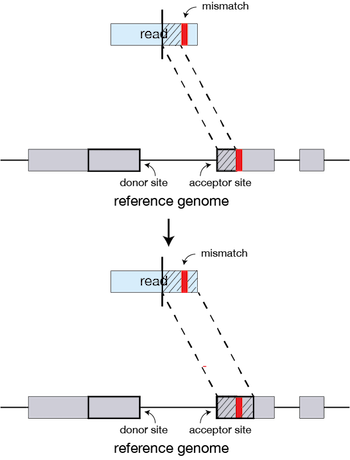
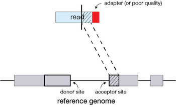
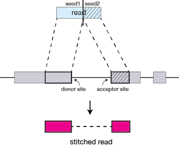

# Alignment

## Learning objectives:

* Understand the basics of read alignment using [STAR](https://github.com/alexdobin/STAR).
* Automate mapping (using *e.g.* Makefile)
* Familiarize with standard file formats


## Read Alignment

Read alignment is generally done using one of several splice-aware alignment tools such as [STAR](https://github.com/alexdobin/STAR) or [HISAT2](https://ccb.jhu.edu/software/hisat2/index.shtml). The splice-aware feature is important for RNA-seq data, because we want an alignment tool that considers splice junctions when performing alignments.
 
For this workshop we will be using STAR (Spliced Transcripts Alignment to a Reference).

### STAR Alignment Strategy

1. Seed searching
2. Clustering, stitching, and scoring

#### Seed searching

For every read that STAR aligns, it searches for the longest sequence that exactly matches one or more locations on the reference genome:


These longest matching sequences are called *Maximal Mappable Prefixes* (MMPs). The different parts of the read that are mapped separately are called 'seeds'.
So the first MMP that is mapped to the genome is called *seed1*.

STAR then searches again for only the unmapped portion of the read to find the next longest sequence that exactly matches the reference genome, which will be *seed2*. 


**If STAR does not find an exact matching sequence** for each part of the read due to mismatches or indels, the seed will be extended.




**If extension does not give a good alignment**, then reads can be soft clipped.




STAR uses an uncompressed suffix array (SA) to efficiently search for the longest matching portions of the read. 


#### Clustering, stitching, and scoring

The separate seeds are stitched together to create a complete read by first clustering the seeds together based on proximity to a set of seeds that have good alignment scores and are not multi-mapping.

Then the seeds are stitched together based on the best alignment for the read (scoring based on mismatches, indels, gaps, *etc.* ). 




### Running STAR


See `Makefile`.

For this workshop, we use a genome index that was already created. In general, you may have to run this step, if you are using STAR and/or a given genome for the first time. See STAR documentation.


### Alignment Outputs (SAM/BAM)

The output from STAR is a BAM file. BAM is a binary, compressed version of the SAM file, also known as *Sequence Alignment Map format*. The SAM file is a tab-delimited text file that contains information for each individual read and its alignment to the genome. See [hts-specs](https://samtools.github.io/hts-specs/) for more details.

The file begins with a **header**, which is optional. The header is used to describe source of data, reference sequence, method of alignment, *etc.*, this will change depending on the aligner being used. Each section begins with character `@` followed by a two-letter record type code. These are followed by two-letter tags and values. This is an exmaple from our data:

```
@HD     VN:1.4
@SQ     SN:1    LN:248956422
@SQ     SN:10   LN:133797422


@PG     ID:STAR PN:STAR VN:STAR_2.6.1d  CL:STAR   --runThreadN 40   --genomeDir /beegfs/biodb/genomes/homo_sapiens/GRCh38_96/star/   --genomeLoad NoSharedMemory   --readFil esIn rrna/SRR7451187__Rep_1__MP60-1__mRNA_Seq__PBS_1.fastq.gz   rrna/SRR7451187__Rep_1__MP60-1__mRNA_Seq__PBS_2.fastq.gz      --readFilesCommand zcat      --outFileNamePref ix star//SRR7451187__Rep_1__MP60-1__mRNA_Seq__PBS/   --outTmpDir 8IeLL3UVf2_SRR7451187__Rep_1__MP60-1__mRNA_Seq__PBS/   --outReadsUnmapped Fastx   --outSAMattributes NH   H I   AS   nM   NM   MD   jM   jI   XS      --outSJfilterOverhangMin 15   15   15   15      --outFilterMultimapNmax 20   --outFilterScoreMin 1   --outFilterMatchNminOverLread  0.7   --outFilterMismatchNmax 999   --outFilterMismatchNoverLmax 0.05   --alignIntronMin 20   --alignIntronMax 1000000   --alignMatesGapMax 1000000   --alignSJoverhangMin 15   --alignSJDBoverhangMin 10   --alignSoftClipAtReferenceEnds No   --chimSegmentMin 15   --chimScoreMin 15   --chimScoreSeparation 10   --chimJunctionOverhangMin 15   --chimOutType Junctions      --chimMultimapNmax 20   --sjdbGTFfile /beegfs/biodb/genomes/homo_sapiens/GRCh38_96/GRCh38.96.gtf   --quantMode GeneCounts      --twopassMode Basic
```

Following the header is the **alignment section**. Each line that follows corresponds to alignment information for a single read. Each alignment line has **11 mandatory fields for essential mapping information** and a variable number of other fields for aligner specific information. 


| Col | Field | Type | Description |
| ------:| ------:| ------:| :----------------------:|
1 | QNAME | String | Query template NAME
2 | FLAG | Int | bitwise FLAG
3 | RNAME | String | References sequence NAME
4 | POS | Int | 1- based leftmost mapping POSition
5 | MAPQ | Int | MAPping Quality
6 | CIGAR | String | CIGAR string
7 | RNEXT | String | Ref. name of the mate/next read
8 | PNEXT | Int | Position of the mate/next read
9 | TLEN | Int | observed Template LENgth
10 | SEQ | String | segment SEQuence
11 | QUAL | String | ASCII of Phred-scaled base QUALity+33 


The `FLAG` value that is displayed can be translated into information about the mapping. 

| Flag | Description |
| ------:|:----------------------:|
| 1 | read is mapped |
| 2 | read is mapped as part of a pair |
| 4 | read is unmapped |
| 8 | mate is unmapped |
| 16| read reverse strand|
| 32 | mate reverse strand |
| 64 | first in pair |
| 128 | second in pair |
| 256 | not primary alignment |
| 512 | read fails platform/vendor quality checks |
| 1024| read is PCR or optical duplicate |

* For a given alignment, each of these flags are either **on or off** indicating the condition is **true or false**. 
* The `FLAG` is a combination of all of the individual flags (from the table above) that are true for the alignment 

**There are tools that help you translate the bitwise flag, for example [this one from Picard](https://broadinstitute.github.io/picard/explain-flags.html)**

`CIGAR` is a sequence of letters and numbers that represent the *edits or operations* required to match the read to the reference. The letters are operations that are used to indicate which bases align to the reference (i.e. match, mismatch, deletion, insertion), and the numbers indicate the associated base lengths for each 'operation'.

| Operation | Description |
| ------:|:----------------------:|
| M | sequence match or mismatch |
| I | insertion to the reference |
| D | deletion from reference |
| N | skipped region from the reference|

Finally, you have the data from the original FASTQ file stored for each read. That is the raw sequence (`SEQ`) and the associated quality values for each position in the read (`QUAL`).


## `samtools`

[SAMtools](http://samtools.sourceforge.net/) is a tool that provides alot of functionality in dealing with SAM files. SAMtools utilities include, but are not limited to, viewing, sorting, filtering, merging, and indexing alignments in the SAM format. In this lesson we will explore a few of these utilities on our alignment files. To use this we need to load the module.


### Viewing the SAM file

We can use `samtools` to take a quick peek at our own files. Using the `view` command within `samtools` we can easily convert the BAM into something that we can understand. You will be returned to screen the entire SAM file, and so we can either write to file, or pipe this to the `less` command so we can scroll through it.


```
$ samtools view -h /pub/hbigs_course_2022/part1_RNAseq/full/star/SRR7451187__Rep_1__MP60-1__mRNA_Seq__PBS/Aligned.noS.bam | less

``` 

## Visualization

We can use [IGV](https://software.broadinstitute.org/software/igv/).


---
*Part of this lesson were inspired by material taken from [Intro-to-rnaseq-hpc-salmon](https://github.com/hbctraining/Intro-to-rnaseq-hpc-salmon).

