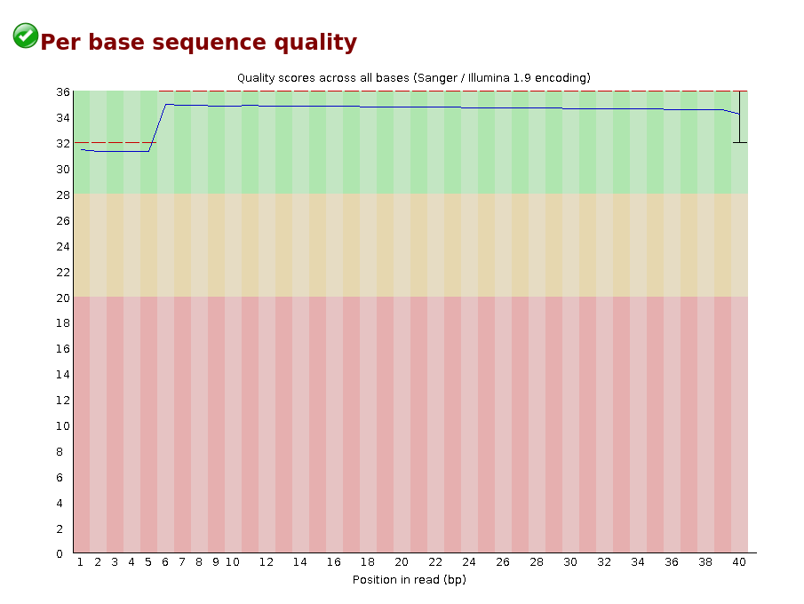
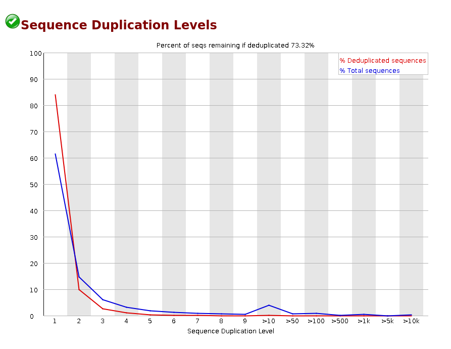
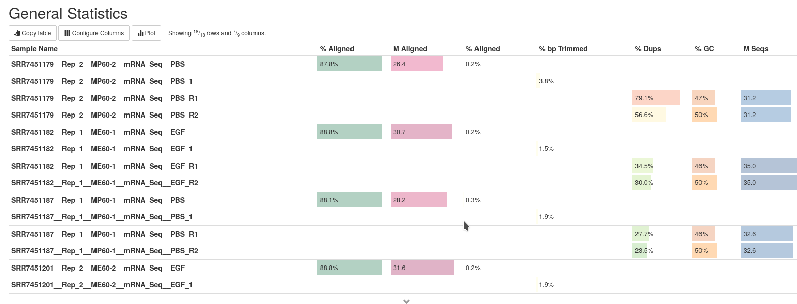

# Quality assessment

## Learning objectives:

* Evaluate the quality of NGS RNA-seq data using standard tools *e.g.* [**FastQC**](https://www.bioinformatics.babraham.ac.uk/projects/fastqc/), or [**MultiQC**](https://multiqc.info/)
* Automate quality assessment (using *e.g.* Makefile)
* Familiarize with standard file formats

## Quality control of FASTQ files

The [FASTQ](https://en.wikipedia.org/wiki/FASTQ_format) file format is used for sequence reads generated from NGS technologies. In comparison to the FASTA format, this file format also contains quality information. The FASTQ file begins with a header line denoted by a `@` character. For each single record (a sequence read) there are four lines:

|Line|Description|
|----|-----------|
|1|Always begins with '@' and then information about the read|
|2|The actual ( *e.g.* cDNA) sequence|
|3|Always begins with a '+' and sometimes the same info in line 1|
|4|A string of characters representing the quality scores; must have same number of characters as line 2|

Let's use the following read from our example data:

```
@SRR7451184.111 111 length=50
AAAAAAAAAAAAAAAAAAAAAAAAAAAAAAAAAAAAGGGAAACCCAACAG
+SRR7451184.111 111 length=50
/AAAAEEEEEEEEEEEEEEEEEEEEEEEEEE66/////////////////
```

The legend below provides the mapping of quality scores ([Phred-33](https://en.wikipedia.org/wiki/Phred_quality_score)) to the quality encoding characters. Each quality score represents the probability that the corresponding nucleotide call is incorrect. Different encoding exists, but the most commonly used one is fastqsanger.

 ```
 Quality encoding: !"#$%&'()*+,-./0123456789:;<=>?@ABCDEFGHI
                   |         |         |         |         |
    Quality score: 0........10........20........30........40                                
```
 
## Assessing quality with FastQC

See `Makefile`.

Several tools exist that help you with the documentation and QC assessment. Here, we used [FastQC](https://www.bioinformatics.babraham.ac.uk/projects/fastqc/), and [MultiQC](https://multiqc.info/). As MultiQC is able to make a report from the output of many different tools, we are running it at a later stage, to integrate several QC metrics of the RNA-seq workflow.

Below, we will only briefly discuss selected output from FastQC/MultiQC. FastQC has a well documented [manual page](http://www.bioinformatics.babraham.ac.uk/projects/fastqc/) with [more details](http://www.bioinformatics.babraham.ac.uk/projects/fastqc/Help/) about all the plots in the report.


### HTML reports

The .html files under the *fastqc* directory contains the FastQC reports. You can have a look at them, after running `make FASTQC`.

Below are typically the most important analysis modules in FastQC, the **"Per base sequence quality"**, the **Sequence Duplication Levels** and the **"Overrepresented sequences"** table. 

The **"Per base sequence quality"** plot provides the distribution of quality scores across all bases at each position in the reads.




The **Sequence Duplication Levels** plot shows the relative number of sequences in a library with different degrees of duplication.




In general most sequences will occur only once in the final set. A high level of duplication can indicate a library of low complexity, or some kind of enrichment bias ( *e.g.* PCR over-amplification). If there are differences between libraries in the complexity or amplification, then this can lead to biases in the data, such as differing %GC content (see also MultiQC report below).


The **"Overrepresented sequences"** table displays the sequences (at least 20 bp) that occur in more than 0.1% of the total number of sequences. This table aids in identifying contamination, such as adapter sequences. See also **Adapter Content** module. If not trimmed, these adapters may affect the assembly and/or mapping outcomes. 

***You should use FastQC as an indicator, don't take the "PASS" and "FAIL" too seriously!***

## Assessing quality metrics with MultiQC

When we have run all rules of our workflow, we will have the results of MultiQC available.

Important metrics to explore first are:

* number of raw reads or total reads
* percentage of reads aligned to genome


To view the total number of reads, you may need to configure the columns, just underneath the 'General Statistics' heading. 



We can see *e.g.* the output of STAR, Flexbar, and Bowtie2.

STAR gives information about *uniquely mapping reads* in the `%Aligned` column. A good quality sample can have **more than 75% of the reads uniquely mapped**, below 60% it's advisable to start troubleshooting, but this depends on the organism and the quelity of the genome. The lower the number of uniquely mapping reads, the higher the number of reads that are mapping to multiple locations. The 'STAR: Alignment Scores' plot visually represents much of this information.

You can also have a look at the Flexbar output, to see how many reads are left for the remaining analysis. See also below (Quality Control - Trimming)

**Note** Bowtie2 is used to perform *in silico* rRNA removal. Look at the output, and try to figure out what is happening!


### Exploring biases

To further explore additional bias metrics, you can use tools such as [RSeQC](http://rseqc.sourceforge.net/)


## Quality Control - Trimming 

We perform quality-based trimming, and adapter removal using [**FlexBar**](https://github.com/seqan/flexbar).
This steps is important to make sure that the good quality reads have a chance to map/align to the genome, and that unwanted information is trimmed off (adapter sequences,poor quality bases at read ends, *etc.* )


---
*Part of this lesson were inspired by material taken from [Intro-to-rnaseq-hpc-salmon](https://github.com/hbctraining/Intro-to-rnaseq-hpc-salmon).
